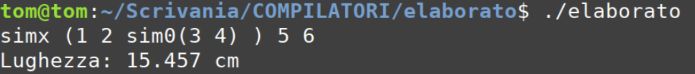
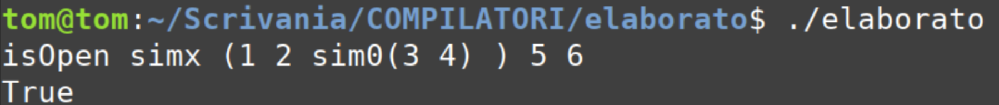
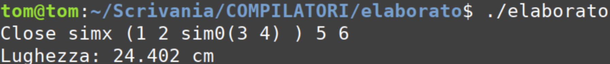
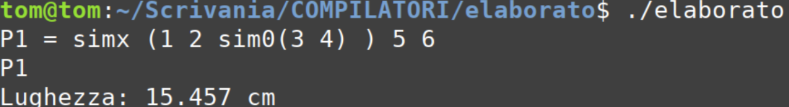
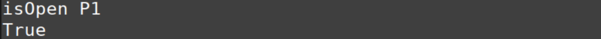
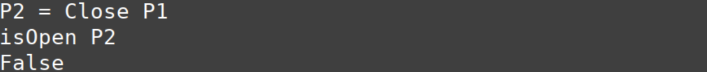
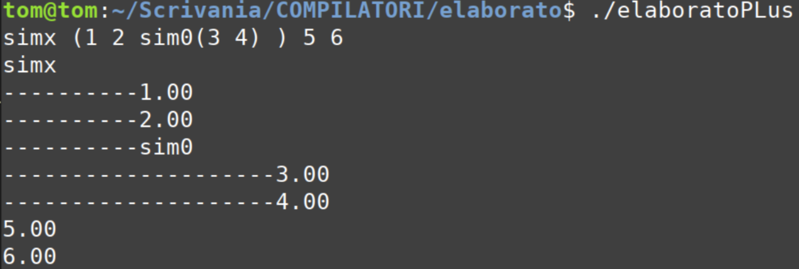
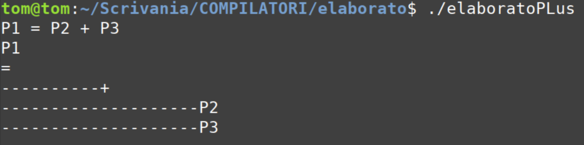

# Compiler Lab Project 
# A.Y. 2023-2024

 Tommaso Vilotto - VR471487
Alex Gaiga - VR471343


## Index

- [Compiler Lab Project](#compiler-lab-project)
- [A.Y. 2023-2024](#ay-2023-2024)
  - [Index](#index)
  - [Description](#description)
  - [Requirements](#requirements)
  - [Compilation \& Execution](#compilation--execution)
  - [Commands and examples](#commands-and-examples)
  - [Design Choices](#design-choices)

## Description
**MAIN LANGUAGE:**


This project uses Lex and Yacc to create a syntax analyzer for a specific language dedicated to the definition and manipulation of polylines. A polyline is a sequence of contiguous linear segments. If the initial and final points of the polyline coincide, the polyline is defined as 'closed', otherwise it is 'open'.

**Features**:
**Polyline Definition**:
- It is possible to define a polyline by specifying an arbitrary number of points.

**Symmetries**:
- Points can be obtained through symmetry with respect to the origin (sim0), the x-axis (simx), or the y-axis (simy).

**Polyline Operations**:
- isOpen: Checks if the polyline is open. A single point is considered a closed polyline.
- Close: Closes an open polyline and calculates the length of the resulting closed polyline (polygon perimeter).

**Saving Polylines in Variables**:
- It is possible to save a polyline by associating it with a variable.
- Execute isOpen and Close commands with saved polylines
- Perform binary addition between polylines, assigning the result to a variable


**Abstract Syntax Tree (AST)**
Valid text in the polyline language is translated into an Abstract Syntax Tree, obtaining a structure that represents the hierarchy and relationships between points and symmetries.
Note: this feature is available by compiling a different file from the one containing all the features mentioned above. See the [Compilation and Execution](#Compilation_&_Execution) section for more information.
## Requirements
To compile the sources on Linux and run the program, two packages must be installed: flex and bison.
If necessary, they can be installed using the following command:
```console
sudo apt-get install flex bison
```
## Compilation & Execution
For compilation, simply navigate to the folder containing the files and execute the **make** command in the terminal.
This command will generate two executable files:
- elaborato
- elaboratoPlus

The first contains all features except the AST, the second exclusively contains the AST feature.

To run the program, simply launch one of the two executables as follows:

```console
$ ./elaborato
```

## Commands and examples
**EXECUTION** ./elaborato

- Creating temporary polyline and displaying its length:


- Creating temporary polyline and displaying its length using symmetric coordinates with respect to the origin (sim0), the x-axis (simx), or the y-axis (simy):

- Checking if the temporary polyline is open:


- Closing the temporary polyline with output of its length:


- Saving a polyline by associating it with a variable and displaying its length by calling the name:


- Checking if the polyline saved in a variable is open:


- Assigning to a variable the closure of a polyline:


- Assigning to a variable the sum obtained by connecting two polylines that are themselves saved in variables:


**EXECUTION** ./elaboratoPlus

It is possible to visualize the Abstract Syntax Tree of all the commands illustrated above, displaying on screen the depth of the elements that are part of it. Below are a couple of examples.

- Example of temporary polyline with coordinates symmetric to the x-axis and origin:


- Example of assignment of conjunction of two polylines

## Design Choices
***First part***
- input is accepted if and only if it is free of semicolons; using end of line, it is possible to provide multiple commands sequentially.
- we decided to treat points on the Cartesian plane as real numbers, managing them as floats in the code for better accuracy
- in addition to the assignment functionalities, we also added the following unspecified commands:
string eq string

***Second part***
The grammar used for the AST assignment is the same as for the other exercises. An n-ary tree was used for its representation, as the representable points are infinite.

